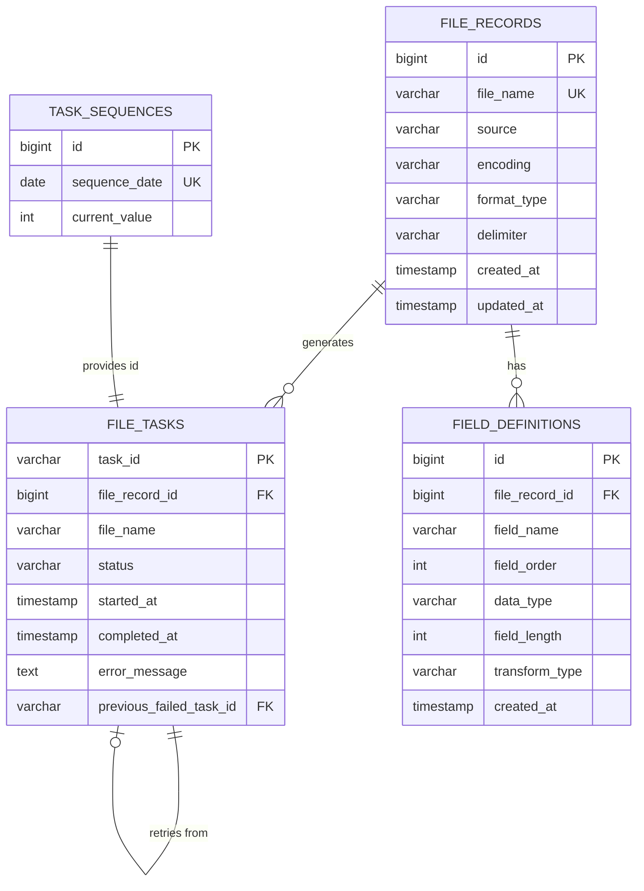

# 資料模型設計：BOA 批次轉檔服務

**專案**：boa-bch-transformat  
**日期**：2025-12-06  
**版本**：2.0（修正版）  
**狀態**：設計中

---

## 修正說明

本次修正基於以下需求：
1. ❌ 移除 `file_records.field_widths`（與 `field_definitions.field_length` 重複）
2. ❌ 移除 `file_records.file_path` 和 `file_tasks.result_path`（路徑透過 properties 配置）
3. ❌ 移除 `file_tasks.processing_pod`（K8s CronJob 無需記錄）
4. ❌ 移除 `file_tasks.retry_count` 和 `metadata`（無意義）
5. ❌ 移除所有 `updated_at` 的 trigger（改由程式主動更新）
6. ❌ 移除 `task_sequences.created_at` 和 `updated_at`（無意義）
7. ❌ 移除轉碼型態的 `hash` 類型
8. ✅ 保留 `field_definitions.field_length`（固定長度格式需要）

---

## 概述

本文件定義 BOA 批次轉檔服務的完整資料模型，包含資料庫表結構、實體關係、欄位定義與驗證規則。

---

## 資料庫架構圖



---

## 1. 檔案記錄表（file_records）

### 用途
儲存需要處理的檔案基本資訊與格式定義，每筆記錄代表一個待轉換的文字檔案。

### 表結構

```sql
CREATE TABLE file_records (
    id BIGSERIAL PRIMARY KEY,
    file_name VARCHAR(255) NOT NULL UNIQUE,          -- 檔案名稱（唯一）
    source VARCHAR(100),                             -- 檔案來源（可為空，例如：'NAS-A', 'SFTP-Server-1'）
    encoding VARCHAR(20) NOT NULL,                   -- 編碼類型（'big5' 或 'utf-8'）
    format_type VARCHAR(20) NOT NULL,                -- 資料格式類型（'delimited' 或 'fixed_length'）
    delimiter VARCHAR(10),                           -- 分隔符號（format_type='delimited' 時使用）
    created_at TIMESTAMP DEFAULT NOW(),
    updated_at TIMESTAMP,                            -- 由程式主動更新，無 trigger
    
    CONSTRAINT chk_format_type CHECK (format_type IN ('delimited', 'fixed_length')),
    CONSTRAINT chk_encoding CHECK (encoding IN ('big5', 'utf-8')),
    CONSTRAINT chk_delimiter_required CHECK (
        (format_type = 'delimited' AND delimiter IS NOT NULL) OR
        format_type = 'fixed_length'
    )
);

-- 索引
CREATE INDEX idx_file_records_created_at ON file_records(created_at);
```

### 欄位說明

| 欄位 | 類型 | 必填 | 說明 | 範例 |
|-----|------|------|------|------|
| id | BIGSERIAL | ✓ | 主鍵（自增） | 1 |
| file_name | VARCHAR(255) | ✓ | 檔案名稱，唯一識別 | `data_20251202.txt` |
| source | VARCHAR(100) | 選填 | 檔案來源 | `NAS-A` 或 `SFTP-Server-1` |
| encoding | VARCHAR(20) | ✓ | 編碼類型 | `big5` 或 `utf-8` |
| format_type | VARCHAR(20) | ✓ | 資料格式 | `delimited` 或 `fixed_length` |
| delimiter | VARCHAR(10) | 條件 | 分隔符號 | `\|\|` 或 `@!!@` |
| created_at | TIMESTAMP | ✓ | 建立時間 | `2025-12-02 10:00:00` |
| updated_at | TIMESTAMP | 選填 | 更新時間（程式更新） | `2025-12-02 10:30:00` |

### 設計說明

**移除項目**：
- ❌ `file_path`：檔案路徑透過 properties 配置（`input_dir` + `file_name`）
- ❌ `field_widths`：改用 `field_definitions.field_length` 記錄
- ❌ `spec_code`：改為 `source`（紀錄檔案來源，可為空）

**保留理由**：
- ✅ `file_name`：唯一識別檔案
- ✅ `delimiter`：分隔符號格式需要
- ✅ `source`：記錄檔案來源（選填），便於追蹤

---

## 2. 欄位定義表（field_definitions）

### 用途
定義每個檔案的欄位詳細資訊，包含欄位名稱、順序、資料類型、長度與轉碼型態。

### 表結構

```sql
CREATE TABLE field_definitions (
    id BIGSERIAL PRIMARY KEY,
    file_record_id BIGINT NOT NULL REFERENCES file_records(id) ON DELETE CASCADE,
    field_name VARCHAR(100) NOT NULL,                -- 欄位名稱
    field_order INT NOT NULL,                        -- 欄位順序（從 1 開始）
    data_type VARCHAR(20) NOT NULL,                  -- 資料類型
    field_length INT,                                -- 欄位長度（固定長度格式時使用，以顯示寬度計算）
    transform_type VARCHAR(50),                      -- 轉碼型態（供下游服務使用）
    created_at TIMESTAMP DEFAULT NOW(),
    
    CONSTRAINT chk_data_type CHECK (data_type IN ('string', 'int', 'double', 'timestamp')),
    CONSTRAINT chk_field_order_positive CHECK (field_order > 0),
    UNIQUE (file_record_id, field_order)             -- 同一檔案的欄位順序唯一
);

-- 索引
CREATE INDEX idx_field_definitions_file_record ON field_definitions(file_record_id);
CREATE INDEX idx_field_definitions_order ON field_definitions(file_record_id, field_order);
```

### 欄位說明

| 欄位 | 類型 | 必填 | 說明 | 範例 |
|-----|------|------|------|------|
| id | BIGSERIAL | ✓ | 主鍵 | 1 |
| file_record_id | BIGINT | ✓ | 關聯的檔案記錄 ID | 1 |
| field_name | VARCHAR(100) | ✓ | 欄位名稱 | `customer_id` |
| field_order | INT | ✓ | 欄位順序 | 1 |
| data_type | VARCHAR(20) | ✓ | 資料類型 | `string`, `int`, `double`, `timestamp` |
| field_length | INT | 選填 | 固定長度格式的欄位長度（顯示寬度） | 10 |
| transform_type | VARCHAR(50) | 選填 | 轉碼型態標記 | `mask`, `encrypt`, `plain` |
| created_at | TIMESTAMP | ✓ | 建立時間 | `2025-12-02 10:00:00` |

### 資料類型說明

| data_type | 說明 | Parquet 對應類型 | 範例 |
|-----------|------|-----------------|------|
| string | 字串 | `pa.string()` | `張三` |
| int | 整數 | `pa.int64()` | `12345` |
| double | 浮點數 | `pa.float64()` | `123.45` |
| timestamp | 時間戳記 | `pa.timestamp('s')` | `2025-12-02 10:00:00` |

### 轉碼型態說明

| transform_type | 說明 | 用途 |
|---------------|------|------|
| plain | 明文，無需處理 | 一般資料欄位 |
| mask | 需要遮罩 | 敏感資料（如身分證號） |
| encrypt | 需要加密 | 高敏感資料（如密碼） |

### 欄位長度計算方式

**重要**：`field_length` 使用**顯示寬度**（visual width），而非 bytes：
- ASCII 字元：寬度 = 1（例如 'A' = 1）
- 全形字元（中文）：寬度 = 2（例如 '張' = 2）
- 使用 Python `wcwidth` 庫計算正確的顯示寬度

**範例**：
```python
from wcwidth import wcswidth

# "A001      " (10 個字元位置)
wcswidth("A001      ") == 10  # True

# "張三        " (10 個字元位置，中文佔 4，空白佔 6)
wcswidth("張三        ") == 10  # True
```

---

## 3. 任務表（file_tasks）

### 用途
記錄每個檔案的處理任務，包含狀態、執行時間、錯誤訊息與重試關聯。

### 表結構

```sql
CREATE TABLE file_tasks (
    task_id VARCHAR(50) PRIMARY KEY,                 -- 任務 ID（格式：transformat_YYYYMMDD0001）
    file_record_id BIGINT NOT NULL REFERENCES file_records(id),
    file_name VARCHAR(255) NOT NULL,                 -- 冗餘儲存，便於查詢
    status VARCHAR(20) NOT NULL DEFAULT 'pending',   -- 任務狀態
    started_at TIMESTAMP,                            -- 開始處理時間
    completed_at TIMESTAMP,                          -- 完成時間
    error_message TEXT,                              -- 錯誤訊息
    previous_failed_task_id VARCHAR(50) REFERENCES file_tasks(task_id),  -- 前一次失敗的任務 ID
    
    CONSTRAINT chk_status CHECK (status IN ('pending', 'processing', 'completed', 'failed'))
);

-- 索引
CREATE INDEX idx_file_tasks_status ON file_tasks(status);
CREATE INDEX idx_file_tasks_file_record ON file_tasks(file_record_id);
CREATE INDEX idx_file_tasks_started_at ON file_tasks(started_at);
CREATE INDEX idx_file_tasks_file_name ON file_tasks(file_name);
```

### 欄位說明

| 欄位 | 類型 | 必填 | 說明 | 範例 |
|-----|------|------|------|------|
| task_id | VARCHAR(50) | ✓ | 任務 ID（主鍵） | `transformat_202512020001` |
| file_record_id | BIGINT | ✓ | 關聯的檔案記錄 ID | 1 |
| file_name | VARCHAR(255) | ✓ | 檔案名稱（冗餘） | `customer_20251202.txt` |
| status | VARCHAR(20) | ✓ | 任務狀態 | `pending`, `processing`, `completed`, `failed` |
| started_at | TIMESTAMP | 選填 | 開始處理時間 | `2025-12-02 10:00:00` |
| completed_at | TIMESTAMP | 選填 | 完成時間 | `2025-12-02 10:05:30` |
| error_message | TEXT | 選填 | 錯誤訊息 | `編碼錯誤：無法解碼 big5 格式` |
| previous_failed_task_id | VARCHAR(50) | 選填 | 前一次失敗的任務 ID | `transformat_202512010005` |

### 設計說明

**移除項目**：
- ❌ `processing_pod`：K8s CronJob 環境下無需記錄
- ❌ `result_path`：輸出路徑透過 properties 配置（`output_dir` + `file_name`）
- ❌ `retry_count`：可從 `previous_failed_task_id` 鏈追蹤
- ❌ `metadata`：不需要額外元資料
- ❌ `created_at` 和 `updated_at`：與 started_at/completed_at 重複

**保留理由**：
- ✅ `previous_failed_task_id`：追蹤重試歷史
- ✅ `error_message`：錯誤排查必要資訊

---

## 4. 任務序列表（task_sequences）

### 用途
管理任務 ID 的序列生成，確保每天從 0001 開始遞增，多 pod 環境下保證唯一性。

### 表結構

```sql
CREATE TABLE task_sequences (
    id BIGSERIAL PRIMARY KEY,
    sequence_date DATE NOT NULL UNIQUE,              -- 日期（用於重置序列）
    current_value INT NOT NULL DEFAULT 0,            -- 當天的序列值
    
    CONSTRAINT chk_current_value_non_negative CHECK (current_value >= 0)
);

-- 索引
CREATE UNIQUE INDEX idx_task_sequences_date ON task_sequences(sequence_date);
```

### 欄位說明

| 欄位 | 類型 | 必填 | 說明 | 範例 |
|-----|------|------|------|------|
| id | BIGSERIAL | ✓ | 主鍵 | 1 |
| sequence_date | DATE | ✓ | 日期（唯一） | `2025-12-02` |
| current_value | INT | ✓ | 當天的序列值 | 5 |

### 設計說明

**移除項目**：
- ❌ `created_at` 和 `updated_at`：序列表不需要時間戳記

---

## 5. 完整初始化腳本與假資料

### 資料庫初始化

```sql
-- =====================================================
-- BOA 批次轉檔服務 - 資料庫初始化腳本
-- =====================================================

-- 1. 建立 file_records 表
CREATE TABLE file_records (
    id BIGSERIAL PRIMARY KEY,
    file_name VARCHAR(255) NOT NULL UNIQUE,
    source VARCHAR(100),
    encoding VARCHAR(20) NOT NULL,
    format_type VARCHAR(20) NOT NULL,
    delimiter VARCHAR(10),
    created_at TIMESTAMP DEFAULT NOW(),
    updated_at TIMESTAMP,
    CONSTRAINT chk_format_type CHECK (format_type IN ('delimited', 'fixed_length')),
    CONSTRAINT chk_encoding CHECK (encoding IN ('big5', 'utf-8')),
    CONSTRAINT chk_delimiter_required CHECK (
        (format_type = 'delimited' AND delimiter IS NOT NULL) OR
        format_type = 'fixed_length'
    )
);

CREATE INDEX idx_file_records_created_at ON file_records(created_at);

-- 2. 建立 field_definitions 表
CREATE TABLE field_definitions (
    id BIGSERIAL PRIMARY KEY,
    file_record_id BIGINT NOT NULL REFERENCES file_records(id) ON DELETE CASCADE,
    field_name VARCHAR(100) NOT NULL,
    field_order INT NOT NULL,
    data_type VARCHAR(20) NOT NULL,
    field_length INT,
    transform_type VARCHAR(50),
    created_at TIMESTAMP DEFAULT NOW(),
    CONSTRAINT chk_data_type CHECK (data_type IN ('string', 'int', 'double', 'timestamp')),
    CONSTRAINT chk_field_order_positive CHECK (field_order > 0),
    UNIQUE (file_record_id, field_order)
);

CREATE INDEX idx_field_definitions_file_record ON field_definitions(file_record_id);
CREATE INDEX idx_field_definitions_order ON field_definitions(file_record_id, field_order);

-- 3. 建立 file_tasks 表
CREATE TABLE file_tasks (
    task_id VARCHAR(50) PRIMARY KEY,
    file_record_id BIGINT NOT NULL REFERENCES file_records(id),
    file_name VARCHAR(255) NOT NULL,
    status VARCHAR(20) NOT NULL DEFAULT 'pending',
    started_at TIMESTAMP,
    completed_at TIMESTAMP,
    error_message TEXT,
    previous_failed_task_id VARCHAR(50) REFERENCES file_tasks(task_id),
    CONSTRAINT chk_status CHECK (status IN ('pending', 'processing', 'completed', 'failed'))
);

CREATE INDEX idx_file_tasks_status ON file_tasks(status);
CREATE INDEX idx_file_tasks_file_record ON file_tasks(file_record_id);
CREATE INDEX idx_file_tasks_started_at ON file_tasks(started_at);
CREATE INDEX idx_file_tasks_file_name ON file_tasks(file_name);

-- 4. 建立 task_sequences 表
CREATE TABLE task_sequences (
    id BIGSERIAL PRIMARY KEY,
    sequence_date DATE NOT NULL UNIQUE,
    current_value INT NOT NULL DEFAULT 0,
    CONSTRAINT chk_current_value_non_negative CHECK (current_value >= 0)
);

CREATE UNIQUE INDEX idx_task_sequences_date ON task_sequences(sequence_date);
```

### 完整假資料

```sql
-- =====================================================
-- 假資料插入
-- =====================================================

-- 插入檔案記錄 - 分隔符號格式（big5）
INSERT INTO file_records (file_name, source, encoding, format_type, delimiter) VALUES
('customer_20251206_001.txt', 'NAS-A', 'big5', 'delimited', '||');

-- 插入欄位定義 - customer_20251206_001.txt
INSERT INTO field_definitions (file_record_id, field_name, field_order, data_type, transform_type) VALUES
(1, 'customer_id', 1, 'string', 'plain'),
(1, 'customer_name', 2, 'string', 'mask'),
(1, 'id_number', 3, 'string', 'mask'),
(1, 'birth_date', 4, 'timestamp', 'plain'),
(1, 'account_balance', 5, 'double', 'encrypt');

-- 插入檔案記錄 - 固定長度格式（utf-8）
INSERT INTO file_records (file_name, source, encoding, format_type) VALUES
('transaction_20251206_001.txt', 'SFTP-Server-1', 'utf-8', 'fixed_length');

-- 插入欄位定義 - transaction_20251206_001.txt（固定長度，使用顯示寬度）
INSERT INTO field_definitions (file_record_id, field_name, field_order, data_type, field_length, transform_type) VALUES
(2, 'transaction_id', 1, 'string', 10, 'plain'),        -- 顯示寬度 10
(2, 'customer_name', 2, 'string', 10, 'mask'),          -- 顯示寬度 10（中文 2 個字 + 空白）
(2, 'amount', 3, 'double', 12, 'plain'),                -- 顯示寬度 12
(2, 'transaction_date', 4, 'timestamp', 8, 'plain'),    -- 顯示寬度 8（YYYYMMDD）
(2, 'status', 5, 'string', 5, 'plain');                 -- 顯示寬度 5

-- 插入任務序列
INSERT INTO task_sequences (sequence_date, current_value) VALUES
('2025-12-06', 3);

-- 插入任務記錄 - 已完成
INSERT INTO file_tasks (
    task_id, file_record_id, file_name, status, 
    started_at, completed_at
) VALUES (
    'transformat_202512060001',
    1,
    'customer_20251206_001.txt',
    'completed',
    '2025-12-06 10:00:00',
    '2025-12-06 10:05:30'
);

-- 插入任務記錄 - 失敗
INSERT INTO file_tasks (
    task_id, file_record_id, file_name, status, 
    started_at, completed_at, error_message
) VALUES (
    'transformat_202512060002',
    2,
    'transaction_20251206_001.txt',
    'failed',
    '2025-12-06 10:10:00',
    '2025-12-06 10:10:15',
    '編碼錯誤：檔案實際編碼為 big5，但資料庫記錄為 utf-8'
);

-- 插入任務記錄 - 重試（關聯到前一次失敗的任務）
INSERT INTO file_tasks (
    task_id, file_record_id, file_name, status, 
    previous_failed_task_id
) VALUES (
    'transformat_202512060003',
    2,
    'transaction_20251206_001.txt',
    'pending',
    'transformat_202512060002'
);
```

### 原始測試檔案內容

#### customer_20251206_001.txt（big5 編碼，分隔符號格式）

```text
A001||張三||A123456789||19800101||50000.50
A002||李四||B987654321||19900215||75000.00
A003||王五||C111222333||19850620||60000.25
```

#### transaction_20251206_001.txt（utf-8 編碼，固定長度格式）

```text
TXN0000001張三        000050000.5020251206DONE 
TXN0000002李四        000075000.0020251206DONE 
TXN0000003王小明      000060000.2520251206PEND 
```

**欄位說明**：
- `transaction_id`：10 個顯示寬度（`TXN0000001`）
- `customer_name`：10 個顯示寬度（`張三` = 4，空白 = 6）
- `amount`：12 個顯示寬度（`000050000.50`）
- `transaction_date`：8 個顯示寬度（`20251206`）
- `status`：5 個顯示寬度（`DONE ` 或 `PEND `）

---

## 6. 查詢範例

### 查詢待處理的檔案

```sql
-- 查詢來自特定來源且尚未處理的檔案
SELECT 
    fr.id,
    fr.file_name,
    fr.encoding,
    fr.format_type,
    fr.delimiter
FROM file_records fr
WHERE fr.source = 'NAS-A'  -- 可選：依來源篩選
  AND NOT EXISTS (
      SELECT 1 
      FROM file_tasks ft 
      WHERE ft.file_record_id = fr.id 
        AND ft.status IN ('pending', 'processing', 'completed')
  )
ORDER BY fr.created_at ASC;
```

### 查詢檔案的欄位定義

```sql
-- 查詢特定檔案的欄位定義（按順序）
SELECT 
    field_name,
    field_order,
    data_type,
    field_length,
    transform_type
FROM field_definitions
WHERE file_record_id = 1
ORDER BY field_order ASC;
```

### 查詢任務處理統計

```sql
-- 統計各狀態的任務數量（今天開始的任務）
SELECT 
    status,
    COUNT(*) as task_count,
    COUNT(DISTINCT file_record_id) as unique_files
FROM file_tasks
WHERE started_at >= CURRENT_DATE OR (status = 'pending' AND task_id LIKE 'transformat_' || TO_CHAR(CURRENT_DATE, 'YYYYMMDD') || '%')
GROUP BY status
ORDER BY status;
```

### 查詢失敗任務與重試歷史

```sql
-- 查詢失敗任務及其重試歷史
SELECT 
    t1.task_id as failed_task_id,
    t1.file_name,
    t1.error_message,
    t1.completed_at as failed_at,
    t2.task_id as retry_task_id,
    t2.status as retry_status
FROM file_tasks t1
LEFT JOIN file_tasks t2 ON t2.previous_failed_task_id = t1.task_id
WHERE t1.status = 'failed'
ORDER BY t1.completed_at DESC;
```

---

## 7. 設計決策說明

### 為何移除 `file_records.field_widths`？

**問題**：
- `field_widths` 儲存 JSON 陣列 `[10, 5, 20]`
- `field_definitions.field_length` 儲存個別欄位長度
- **資料重複**，違反正規化原則

**解決方案**：
- ✅ 保留 `field_definitions.field_length`
- ❌ 移除 `file_records.field_widths`
- 程式從 `field_definitions` 按 `field_order` 讀取長度

### 為何將 `spec_code` 改為 `source`？

**原因**：
- `spec_code` 固定為專案名稱（如 'boa-bch-transformat'），缺乏實際意義
- 改為 `source` 記錄檔案來源（如 'NAS-A', 'SFTP-Server-1'），更有追蹤價值
- 允許為空，不強制填寫

### 為何移除 `file_tasks` 的 `created_at` 和 `updated_at`？

**原因**：
- `created_at` 通常與 `started_at` 相同（任務建立後立即開始）
- `updated_at` 通常與 `completed_at` 相同（任務完成時最後更新）
- **資料重複**，增加不必要的維護成本
- 使用 `started_at` 和 `completed_at` 已足夠追蹤任務時間

### 為何需要 `wcwidth`？

**問題**：固定長度欄位的「長度」定義不清

**分析**：
```python
# Bytes 計算（錯誤）
len("張三".encode('utf-8')) == 6  # UTF-8: 3 bytes × 2

# 顯示寬度計算（正確）
from wcwidth import wcswidth
wcswidth("張三") == 4  # 全形字元 × 2
```

**決策**：
- ✅ **使用 `wcwidth` 依賴**
- 理由：固定長度格式通常指**顯示寬度**（視覺對齊）
- 範例：`"A001      "` 和 `"張三      "` 都是 10 個顯示位置

### 為何移除事務隔離等級調整？

**原則**：使用資料庫預設設定（PostgreSQL 預設為 READ COMMITTED）

**理由**：
- PostgreSQL advisory lock 已提供並行控制
- 不需要更高的隔離等級
- 避免過度設計

---

## 總結

本資料模型設計涵蓋：
- ✅ 4 個核心資料表（簡化版）
- ✅ 完整的假資料與測試檔案
- ✅ 移除冗餘與無意義欄位
- ✅ 路徑透過 properties 配置
- ✅ 支援 `wcwidth` 進行顯示寬度計算
- ✅ 無 trigger，updated_at 由程式更新
- ✅ 符合 K8s CronJob 運行模式

此設計可直接用於資料庫實作與應用程式開發。
