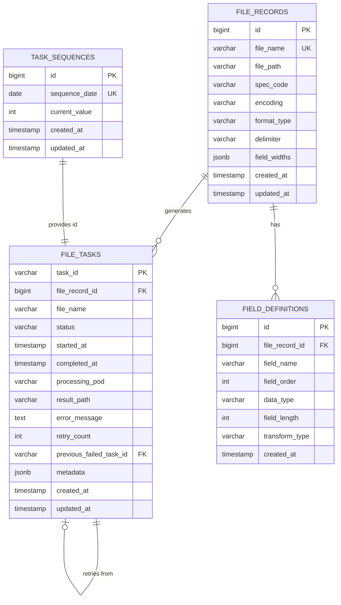
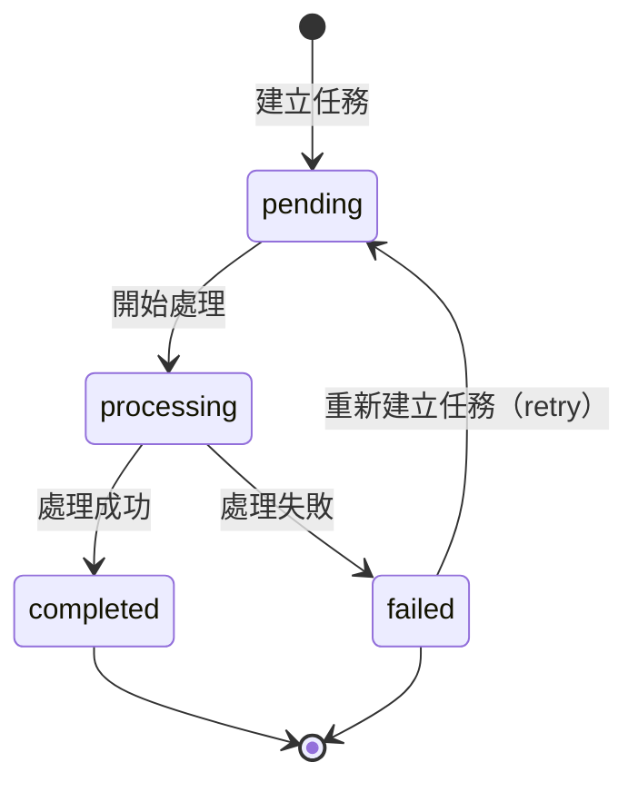

# 資料模型設計：BOA 批次轉檔服務

**專案**：boa-bch-transformat  
**日期**：2025-12-02  
**版本**：1.0  
**狀態**：設計中

---

## 概述

本文件定義 BOA 批次轉檔服務的完整資料模型，包含資料庫表結構、實體關係、欄位定義與驗證規則。

---

## 資料庫架構圖



---

## 1. 檔案記錄表（file_records）

### 用途
儲存需要處理的檔案基本資訊與格式定義，每筆記錄代表一個待轉換的文字檔案。

### 表結構

```sql
CREATE TABLE file_records (
    id BIGSERIAL PRIMARY KEY,
    file_name VARCHAR(255) NOT NULL UNIQUE,          -- 檔案名稱（唯一）
    file_path VARCHAR(1000) NOT NULL,                -- 檔案在 NAS 上的完整路徑
    spec_code VARCHAR(50) NOT NULL,                  -- 規格識別碼（此專案為 'boa-bch-transformat'）
    encoding VARCHAR(20) NOT NULL,                   -- 編碼類型（'big5' 或 'utf-8'）
    format_type VARCHAR(20) NOT NULL,                -- 資料格式類型（'delimited' 或 'fixed_length'）
    delimiter VARCHAR(10),                           -- 分隔符號（format_type='delimited' 時使用）
    field_widths JSONB,                              -- 欄位長度定義（format_type='fixed_length' 時使用）
    created_at TIMESTAMP DEFAULT NOW(),
    updated_at TIMESTAMP DEFAULT NOW(),
    
    CONSTRAINT chk_format_type CHECK (format_type IN ('delimited', 'fixed_length')),
    CONSTRAINT chk_encoding CHECK (encoding IN ('big5', 'utf-8')),
    CONSTRAINT chk_delimiter_required CHECK (
        (format_type = 'delimited' AND delimiter IS NOT NULL) OR
        (format_type = 'fixed_length' AND field_widths IS NOT NULL)
    )
);

-- 索引
CREATE INDEX idx_file_records_spec_code ON file_records(spec_code);
CREATE INDEX idx_file_records_created_at ON file_records(created_at);

-- 觸發器：更新 updated_at
CREATE OR REPLACE FUNCTION update_updated_at_column()
RETURNS TRIGGER AS $$
BEGIN
    NEW.updated_at = NOW();
    RETURN NEW;
END;
$$ LANGUAGE plpgsql;

CREATE TRIGGER update_file_records_updated_at
    BEFORE UPDATE ON file_records
    FOR EACH ROW
    EXECUTE FUNCTION update_updated_at_column();
```

### 欄位說明

| 欄位 | 類型 | 必填 | 說明 | 範例 |
|-----|------|------|------|------|
| id | BIGSERIAL | ✓ | 主鍵（自增） | 1 |
| file_name | VARCHAR(255) | ✓ | 檔案名稱，唯一識別 | `data_20251202.txt` |
| file_path | VARCHAR(1000) | ✓ | NAS 完整路徑 | `/nas/input/data_20251202.txt` |
| spec_code | VARCHAR(50) | ✓ | 規格識別碼 | `boa-bch-transformat` |
| encoding | VARCHAR(20) | ✓ | 編碼類型 | `big5` 或 `utf-8` |
| format_type | VARCHAR(20) | ✓ | 資料格式 | `delimited` 或 `fixed_length` |
| delimiter | VARCHAR(10) | 條件 | 分隔符號 | `\|\|` 或 `@!!@` |
| field_widths | JSONB | 條件 | 欄位長度陣列 | `[10, 5, 20, 8]` |
| created_at | TIMESTAMP | ✓ | 建立時間 | `2025-12-02 10:00:00` |
| updated_at | TIMESTAMP | ✓ | 更新時間 | `2025-12-02 10:30:00` |

### 資料範例

```sql
-- 範例 1：分隔符號格式（big5）
INSERT INTO file_records (
    file_name, file_path, spec_code, encoding, format_type, delimiter
) VALUES (
    'customer_20251202.txt',
    '/nas/input/customer_20251202.txt',
    'boa-bch-transformat',
    'big5',
    'delimited',
    '||'
);

-- 範例 2：固定長度格式（utf-8）
INSERT INTO file_records (
    file_name, file_path, spec_code, encoding, format_type, field_widths
) VALUES (
    'transaction_20251202.txt',
    '/nas/input/transaction_20251202.txt',
    'boa-bch-transformat',
    'utf-8',
    'fixed_length',
    '[10, 5, 20, 8, 12]'::jsonb
);
```

---

## 2. 欄位定義表（field_definitions）

### 用途
定義每個檔案的欄位詳細資訊，包含欄位名稱、順序、資料類型、長度與轉碼型態。

### 表結構

```sql
CREATE TABLE field_definitions (
    id BIGSERIAL PRIMARY KEY,
    file_record_id BIGINT NOT NULL REFERENCES file_records(id) ON DELETE CASCADE,
    field_name VARCHAR(100) NOT NULL,                -- 欄位名稱
    field_order INT NOT NULL,                        -- 欄位順序（從 1 開始）
    data_type VARCHAR(20) NOT NULL,                  -- 資料類型
    field_length INT,                                -- 欄位長度（固定長度格式時使用）
    transform_type VARCHAR(50),                      -- 轉碼型態（供下游服務使用）
    created_at TIMESTAMP DEFAULT NOW(),
    
    CONSTRAINT chk_data_type CHECK (data_type IN ('string', 'int', 'double', 'timestamp')),
    CONSTRAINT chk_field_order_positive CHECK (field_order > 0),
    UNIQUE (file_record_id, field_order)             -- 同一檔案的欄位順序唯一
);

-- 索引
CREATE INDEX idx_field_definitions_file_record ON field_definitions(file_record_id);
CREATE INDEX idx_field_definitions_order ON field_definitions(file_record_id, field_order);
```

### 欄位說明

| 欄位 | 類型 | 必填 | 說明 | 範例 |
|-----|------|------|------|------|
| id | BIGSERIAL | ✓ | 主鍵 | 1 |
| file_record_id | BIGINT | ✓ | 關聯的檔案記錄 ID | 1 |
| field_name | VARCHAR(100) | ✓ | 欄位名稱 | `customer_id` |
| field_order | INT | ✓ | 欄位順序 | 1 |
| data_type | VARCHAR(20) | ✓ | 資料類型 | `string`, `int`, `double`, `timestamp` |
| field_length | INT | 選填 | 固定長度格式的欄位長度 | 10 |
| transform_type | VARCHAR(50) | 選填 | 轉碼型態標記 | `mask`, `encrypt`, `plain` |
| created_at | TIMESTAMP | ✓ | 建立時間 | `2025-12-02 10:00:00` |

### 資料類型說明

| data_type | 說明 | Parquet 對應類型 | 範例 |
|-----------|------|-----------------|------|
| string | 字串 | `pa.string()` | `張三` |
| int | 整數 | `pa.int64()` | `12345` |
| double | 浮點數 | `pa.float64()` | `123.45` |
| timestamp | 時間戳記 | `pa.timestamp('s')` | `2025-12-02 10:00:00` |

### 轉碼型態說明

| transform_type | 說明 | 用途 |
|---------------|------|------|
| plain | 明文，無需處理 | 一般資料欄位 |
| mask | 需要遮罩 | 敏感資料（如身分證號） |
| encrypt | 需要加密 | 高敏感資料（如密碼） |
| hash | 需要雜湊 | 不可逆敏感資料 |

### 資料範例

```sql
-- customer_20251202.txt 的欄位定義
INSERT INTO field_definitions (
    file_record_id, field_name, field_order, data_type, field_length, transform_type
) VALUES
    (1, 'customer_id', 1, 'string', 10, 'plain'),
    (1, 'customer_name', 2, 'string', 20, 'mask'),
    (1, 'id_number', 3, 'string', 10, 'mask'),
    (1, 'birth_date', 4, 'timestamp', 8, 'plain'),
    (1, 'account_balance', 5, 'double', 12, 'encrypt');
```

---

## 3. 任務表（file_tasks）

### 用途
記錄每個檔案的處理任務，包含狀態、執行時間、結果、錯誤訊息與重試資訊。

### 表結構

```sql
CREATE TABLE file_tasks (
    task_id VARCHAR(50) PRIMARY KEY,                 -- 任務 ID（格式：transformat_YYYYMMDD0001）
    file_record_id BIGINT NOT NULL REFERENCES file_records(id),
    file_name VARCHAR(255) NOT NULL,                 -- 冗餘儲存，便於查詢
    status VARCHAR(20) NOT NULL DEFAULT 'pending',   -- 任務狀態
    started_at TIMESTAMP,                            -- 開始處理時間
    completed_at TIMESTAMP,                          -- 完成時間
    processing_pod VARCHAR(100),                     -- 處理的 pod 名稱
    result_path VARCHAR(1000),                       -- 產出的 Parquet 檔案路徑
    error_message TEXT,                              -- 錯誤訊息
    retry_count INT NOT NULL DEFAULT 0,              -- 重試次數
    previous_failed_task_id VARCHAR(50) REFERENCES file_tasks(task_id),  -- 前一次失敗的任務 ID
    metadata JSONB,                                  -- 額外元資料
    created_at TIMESTAMP DEFAULT NOW(),
    updated_at TIMESTAMP DEFAULT NOW(),
    
    CONSTRAINT chk_status CHECK (status IN ('pending', 'processing', 'completed', 'failed')),
    CONSTRAINT chk_retry_count_non_negative CHECK (retry_count >= 0)
);

-- 索引
CREATE INDEX idx_file_tasks_status ON file_tasks(status);
CREATE INDEX idx_file_tasks_file_record ON file_tasks(file_record_id);
CREATE INDEX idx_file_tasks_created_at ON file_tasks(created_at);
CREATE INDEX idx_file_tasks_file_name ON file_tasks(file_name);

-- 觸發器：更新 updated_at
CREATE TRIGGER update_file_tasks_updated_at
    BEFORE UPDATE ON file_tasks
    FOR EACH ROW
    EXECUTE FUNCTION update_updated_at_column();
```

### 欄位說明

| 欄位 | 類型 | 必填 | 說明 | 範例 |
|-----|------|------|------|------|
| task_id | VARCHAR(50) | ✓ | 任務 ID（主鍵） | `transformat_202512020001` |
| file_record_id | BIGINT | ✓ | 關聯的檔案記錄 ID | 1 |
| file_name | VARCHAR(255) | ✓ | 檔案名稱（冗餘） | `customer_20251202.txt` |
| status | VARCHAR(20) | ✓ | 任務狀態 | `pending`, `processing`, `completed`, `failed` |
| started_at | TIMESTAMP | 選填 | 開始處理時間 | `2025-12-02 10:00:00` |
| completed_at | TIMESTAMP | 選填 | 完成時間 | `2025-12-02 10:05:30` |
| processing_pod | VARCHAR(100) | 選填 | 處理的 pod 名稱 | `transformat-pod-1` |
| result_path | VARCHAR(1000) | 選填 | Parquet 檔案路徑 | `/nas/output/customer_20251202.parquet` |
| error_message | TEXT | 選填 | 錯誤訊息 | `編碼錯誤：無法解碼 big5 格式` |
| retry_count | INT | ✓ | 重試次數 | 0 |
| previous_failed_task_id | VARCHAR(50) | 選填 | 前一次失敗的任務 ID | `transformat_202512010005` |
| metadata | JSONB | 選填 | 額外元資料 | `{"rows_processed": 10000}` |
| created_at | TIMESTAMP | ✓ | 建立時間 | `2025-12-02 10:00:00` |
| updated_at | TIMESTAMP | ✓ | 更新時間 | `2025-12-02 10:05:30` |

### 狀態轉換圖



### 狀態說明

| 狀態 | 說明 | 可轉換至 |
|-----|------|---------|
| pending | 待處理 | processing |
| processing | 處理中 | completed, failed |
| completed | 已完成 | - |
| failed | 處理失敗 | - |

### 資料範例

```sql
-- 成功處理的任務
INSERT INTO file_tasks (
    task_id, file_record_id, file_name, status, 
    started_at, completed_at, processing_pod, result_path, metadata
) VALUES (
    'transformat_202512020001',
    1,
    'customer_20251202.txt',
    'completed',
    '2025-12-02 10:00:00',
    '2025-12-02 10:05:30',
    'transformat-pod-1',
    '/nas/output/customer_20251202.parquet',
    '{"rows_processed": 10000, "file_size_mb": 50}'::jsonb
);

-- 失敗的任務
INSERT INTO file_tasks (
    task_id, file_record_id, file_name, status, 
    started_at, completed_at, processing_pod, error_message, retry_count
) VALUES (
    'transformat_202512020002',
    2,
    'transaction_20251202.txt',
    'failed',
    '2025-12-02 10:10:00',
    '2025-12-02 10:10:15',
    'transformat-pod-2',
    '編碼錯誤：檔案實際編碼為 utf-8，但資料庫記錄為 big5',
    0
);

-- 重試的任務（關聯到前一次失敗的任務）
INSERT INTO file_tasks (
    task_id, file_record_id, file_name, status, 
    retry_count, previous_failed_task_id
) VALUES (
    'transformat_202512020003',
    2,
    'transaction_20251202.txt',
    'pending',
    1,
    'transformat_202512020002'
);
```

---

## 4. 任務序列表（task_sequences）

### 用途
管理任務 ID 的序列生成，確保每天從 0001 開始遞增，多 pod 環境下保證唯一性。

### 表結構

```sql
CREATE TABLE task_sequences (
    id BIGSERIAL PRIMARY KEY,
    sequence_date DATE NOT NULL UNIQUE,              -- 日期（用於重置序列）
    current_value INT NOT NULL DEFAULT 0,            -- 當天的序列值
    created_at TIMESTAMP DEFAULT NOW(),
    updated_at TIMESTAMP DEFAULT NOW(),
    
    CONSTRAINT chk_current_value_non_negative CHECK (current_value >= 0)
);

-- 索引
CREATE UNIQUE INDEX idx_task_sequences_date ON task_sequences(sequence_date);

-- 觸發器：更新 updated_at
CREATE TRIGGER update_task_sequences_updated_at
    BEFORE UPDATE ON task_sequences
    FOR EACH ROW
    EXECUTE FUNCTION update_updated_at_column();
```

### 欄位說明

| 欄位 | 類型 | 必填 | 說明 | 範例 |
|-----|------|------|------|------|
| id | BIGSERIAL | ✓ | 主鍵 | 1 |
| sequence_date | DATE | ✓ | 日期（唯一） | `2025-12-02` |
| current_value | INT | ✓ | 當天的序列值 | 5 |
| created_at | TIMESTAMP | ✓ | 建立時間 | `2025-12-02 00:00:00` |
| updated_at | TIMESTAMP | ✓ | 更新時間 | `2025-12-02 10:30:00` |

### 序列生成邏輯

```sql
-- 取得下一個序列值（原子操作）
INSERT INTO task_sequences (sequence_date, current_value)
VALUES (CURRENT_DATE, 1)
ON CONFLICT (sequence_date)
DO UPDATE SET 
    current_value = task_sequences.current_value + 1,
    updated_at = NOW()
RETURNING current_value;

-- 生成任務 ID
-- 範例：2025-12-02 的第 5 個任務 → transformat_202512020005
```

### 資料範例

```sql
-- 2025-12-02 當天已生成 5 個任務
INSERT INTO task_sequences (sequence_date, current_value)
VALUES ('2025-12-02', 5);

-- 2025-12-03 當天已生成 3 個任務
INSERT INTO task_sequences (sequence_date, current_value)
VALUES ('2025-12-03', 3);
```

---

## 5. 實體關係與驗證規則

### 關係說明

1. **file_records ↔ field_definitions**（一對多）
   - 一個檔案記錄可以有多個欄位定義
   - 刪除檔案記錄時，級聯刪除其欄位定義

2. **file_records ↔ file_tasks**（一對多）
   - 一個檔案記錄可以有多個任務（重試情況）
   - 同名檔案的重試任務透過 `previous_failed_task_id` 關聯

3. **task_sequences ↔ file_tasks**（一對多）
   - 每個日期的序列記錄對應當天的所有任務

4. **file_tasks ↔ file_tasks**（自關聯）
   - 重試任務透過 `previous_failed_task_id` 指向前一次失敗的任務

### 驗證規則

#### 檔案記錄驗證
- ✅ `file_name` 必須唯一
- ✅ `encoding` 只能是 `big5` 或 `utf-8`
- ✅ `format_type` 只能是 `delimited` 或 `fixed_length`
- ✅ 若 `format_type='delimited'`，`delimiter` 不能為 NULL
- ✅ 若 `format_type='fixed_length'`，`field_widths` 不能為 NULL

#### 欄位定義驗證
- ✅ `field_order` 必須 > 0
- ✅ `data_type` 只能是 `string`、`int`、`double`、`timestamp`
- ✅ 同一檔案的 `field_order` 不能重複

#### 任務驗證
- ✅ `status` 只能是 `pending`、`processing`、`completed`、`failed`
- ✅ `retry_count` 必須 >= 0
- ✅ 若有 `previous_failed_task_id`，該任務必須存在且狀態為 `failed`

### 業務規則

1. **同名檔案重試規則**
   - 若檔案 A 的任務失敗，重新建立任務時：
     - 新任務的 `previous_failed_task_id` 指向失敗的任務
     - 新任務的 `retry_count` = 失敗任務的 `retry_count` + 1
     - 新任務的 `file_name` 與失敗任務相同

2. **任務 ID 生成規則**
   - 格式：`transformat_YYYYMMDD9999`
   - 每天從 0001 開始
   - 使用資料庫序列確保多 pod 環境下的唯一性

3. **任務狀態更新規則**
   - `pending` → `processing`：開始處理時更新 `started_at` 與 `processing_pod`
   - `processing` → `completed`：成功時更新 `completed_at` 與 `result_path`
   - `processing` → `failed`：失敗時更新 `completed_at` 與 `error_message`

---

## 6. 查詢範例

### 查詢待處理的檔案清單

```sql
-- 查詢屬於此規格且尚未處理的檔案
SELECT 
    fr.id,
    fr.file_name,
    fr.file_path,
    fr.encoding,
    fr.format_type,
    fr.delimiter,
    fr.field_widths
FROM file_records fr
WHERE fr.spec_code = 'boa-bch-transformat'
  AND NOT EXISTS (
      SELECT 1 
      FROM file_tasks ft 
      WHERE ft.file_record_id = fr.id 
        AND ft.status IN ('pending', 'processing', 'completed')
  )
ORDER BY fr.created_at ASC;
```

### 查詢檔案的所有欄位定義

```sql
-- 查詢特定檔案的欄位定義（按順序排列）
SELECT 
    field_name,
    field_order,
    data_type,
    field_length,
    transform_type
FROM field_definitions
WHERE file_record_id = 1
ORDER BY field_order ASC;
```

### 查詢任務處理狀態統計

```sql
-- 統計各狀態的任務數量
SELECT 
    status,
    COUNT(*) as task_count,
    COUNT(DISTINCT file_record_id) as unique_files
FROM file_tasks
WHERE created_at >= CURRENT_DATE
GROUP BY status
ORDER BY status;
```

### 查詢失敗任務與重試歷史

```sql
-- 查詢失敗任務及其重試歷史
SELECT 
    t1.task_id as failed_task_id,
    t1.file_name,
    t1.error_message,
    t1.created_at as failed_at,
    t2.task_id as retry_task_id,
    t2.status as retry_status,
    t2.retry_count
FROM file_tasks t1
LEFT JOIN file_tasks t2 ON t2.previous_failed_task_id = t1.task_id
WHERE t1.status = 'failed'
ORDER BY t1.created_at DESC;
```

---

## 7. 初始化腳本

```sql
-- 完整初始化腳本（按順序執行）

-- 1. 建立 updated_at 觸發器函數
CREATE OR REPLACE FUNCTION update_updated_at_column()
RETURNS TRIGGER AS $$
BEGIN
    NEW.updated_at = NOW();
    RETURN NEW;
END;
$$ LANGUAGE plpgsql;

-- 2. 建立 file_records 表
CREATE TABLE file_records (
    id BIGSERIAL PRIMARY KEY,
    file_name VARCHAR(255) NOT NULL UNIQUE,
    file_path VARCHAR(1000) NOT NULL,
    spec_code VARCHAR(50) NOT NULL,
    encoding VARCHAR(20) NOT NULL,
    format_type VARCHAR(20) NOT NULL,
    delimiter VARCHAR(10),
    field_widths JSONB,
    created_at TIMESTAMP DEFAULT NOW(),
    updated_at TIMESTAMP DEFAULT NOW(),
    CONSTRAINT chk_format_type CHECK (format_type IN ('delimited', 'fixed_length')),
    CONSTRAINT chk_encoding CHECK (encoding IN ('big5', 'utf-8')),
    CONSTRAINT chk_delimiter_required CHECK (
        (format_type = 'delimited' AND delimiter IS NOT NULL) OR
        (format_type = 'fixed_length' AND field_widths IS NOT NULL)
    )
);

CREATE INDEX idx_file_records_spec_code ON file_records(spec_code);
CREATE INDEX idx_file_records_created_at ON file_records(created_at);

CREATE TRIGGER update_file_records_updated_at
    BEFORE UPDATE ON file_records
    FOR EACH ROW
    EXECUTE FUNCTION update_updated_at_column();

-- 3. 建立 field_definitions 表
CREATE TABLE field_definitions (
    id BIGSERIAL PRIMARY KEY,
    file_record_id BIGINT NOT NULL REFERENCES file_records(id) ON DELETE CASCADE,
    field_name VARCHAR(100) NOT NULL,
    field_order INT NOT NULL,
    data_type VARCHAR(20) NOT NULL,
    field_length INT,
    transform_type VARCHAR(50),
    created_at TIMESTAMP DEFAULT NOW(),
    CONSTRAINT chk_data_type CHECK (data_type IN ('string', 'int', 'double', 'timestamp')),
    CONSTRAINT chk_field_order_positive CHECK (field_order > 0),
    UNIQUE (file_record_id, field_order)
);

CREATE INDEX idx_field_definitions_file_record ON field_definitions(file_record_id);
CREATE INDEX idx_field_definitions_order ON field_definitions(file_record_id, field_order);

-- 4. 建立 file_tasks 表
CREATE TABLE file_tasks (
    task_id VARCHAR(50) PRIMARY KEY,
    file_record_id BIGINT NOT NULL REFERENCES file_records(id),
    file_name VARCHAR(255) NOT NULL,
    status VARCHAR(20) NOT NULL DEFAULT 'pending',
    started_at TIMESTAMP,
    completed_at TIMESTAMP,
    processing_pod VARCHAR(100),
    result_path VARCHAR(1000),
    error_message TEXT,
    retry_count INT NOT NULL DEFAULT 0,
    previous_failed_task_id VARCHAR(50) REFERENCES file_tasks(task_id),
    metadata JSONB,
    created_at TIMESTAMP DEFAULT NOW(),
    updated_at TIMESTAMP DEFAULT NOW(),
    CONSTRAINT chk_status CHECK (status IN ('pending', 'processing', 'completed', 'failed')),
    CONSTRAINT chk_retry_count_non_negative CHECK (retry_count >= 0)
);

CREATE INDEX idx_file_tasks_status ON file_tasks(status);
CREATE INDEX idx_file_tasks_file_record ON file_tasks(file_record_id);
CREATE INDEX idx_file_tasks_created_at ON file_tasks(created_at);
CREATE INDEX idx_file_tasks_file_name ON file_tasks(file_name);

CREATE TRIGGER update_file_tasks_updated_at
    BEFORE UPDATE ON file_tasks
    FOR EACH ROW
    EXECUTE FUNCTION update_updated_at_column();

-- 5. 建立 task_sequences 表
CREATE TABLE task_sequences (
    id BIGSERIAL PRIMARY KEY,
    sequence_date DATE NOT NULL UNIQUE,
    current_value INT NOT NULL DEFAULT 0,
    created_at TIMESTAMP DEFAULT NOW(),
    updated_at TIMESTAMP DEFAULT NOW(),
    CONSTRAINT chk_current_value_non_negative CHECK (current_value >= 0)
);

CREATE UNIQUE INDEX idx_task_sequences_date ON task_sequences(sequence_date);

CREATE TRIGGER update_task_sequences_updated_at
    BEFORE UPDATE ON task_sequences
    FOR EACH ROW
    EXECUTE FUNCTION update_updated_at_column();
```

---

## 8. 資料遷移與維護

### 資料保留策略

| 表 | 保留期限 | 清理策略 |
|----|---------|---------|
| file_records | 永久 | 不刪除（歷史資料） |
| field_definitions | 永久 | 級聯刪除（隨 file_records） |
| file_tasks | 90 天 | 定期清理已完成任務 |
| task_sequences | 365 天 | 定期清理舊日期記錄 |

### 定期清理腳本

```sql
-- 清理 90 天前已完成的任務
DELETE FROM file_tasks
WHERE status = 'completed'
  AND completed_at < NOW() - INTERVAL '90 days';

-- 清理 365 天前的序列記錄
DELETE FROM task_sequences
WHERE sequence_date < CURRENT_DATE - INTERVAL '365 days';
```

---

## 總結

本資料模型設計涵蓋：
- ✅ 4 個核心資料表
- ✅ 完整的欄位定義與約束
- ✅ 實體關係與級聯規則
- ✅ 索引優化查詢效能
- ✅ 觸發器自動更新時間戳記
- ✅ 任務序列唯一性保證
- ✅ 重試機制與歷史追蹤
- ✅ 查詢範例與初始化腳本

此設計可直接用於資料庫實作與應用程式開發。
