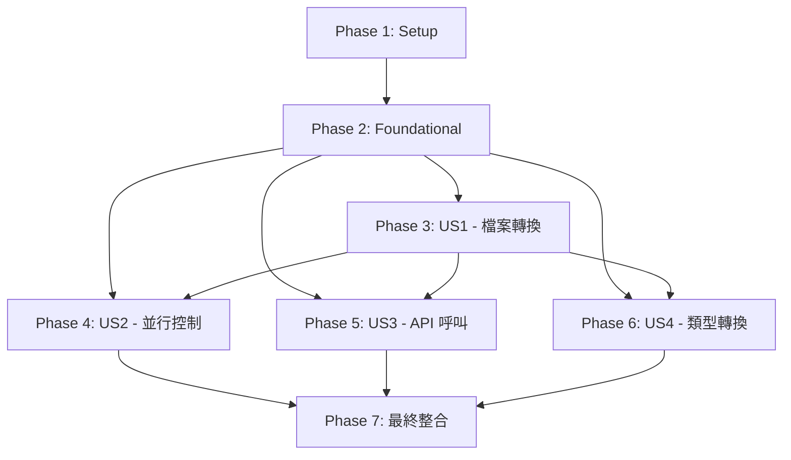

# 任務：BOA 批次轉檔服務

**輸入**：來自 `/specs/001-boa-bch-transformat/` 的設計文件（v4.0）  
**先決條件**：spec.md（v4.0）、plan.md（v4.0）、data-model.md（v4.0）、research.md、contracts/、quickstart.md

**核心設計變更（v4.0）**：
- NAS 掃描 + 檔案前綴匹配（取代資料庫查詢待處理檔案）
- 資料表：file_specifications（取代 file_records），使用 file_prefix 欄位
- 檔案命名：customer20251206001.txt（無底線，連續格式）
- 專案結構：src/ 直接使用（移除 src/transformat/），main.py 在根目錄

**組織原則**：
- 任務按使用者故事分組（US1、US2、US3、US4），確保每個故事可獨立實作和測試
- 任務足夠小，可在 30 分鐘內完成並立即驗證結果
- 遵循 TDD 原則：先寫測試，再寫實作（紅-綠-重構）

## 任務格式：`- [ ] [ID] [P?] [Story] 描述 in 檔案路徑`

- **[P]**：可並行執行（不同檔案、無依賴）
- **[Story]**：所屬使用者故事（US1、US2、US3、US4）
- **路徑**：所有路徑為絕對路徑，從專案根目錄 `boa-bch-transformat/` 開始

---

## Phase 1: 設定（Setup）

**目的**：專案初始化和基本結構  
**優先級**：必須完成，所有後續任務的基礎

### 專案結構初始化

- [ ] T001 建立專案根目錄結構 in boa-bch-transformat/
  ```bash
  mkdir -p boa-bch-transformat/{src,tests/unit,tests/fixtures/sample_files,resources/env,scripts}
  mkdir -p boa-bch-transformat/src/{config,models,services,repositories,utils,exceptions}
  ```

- [ ] T002 初始化 Python 3.13 虛擬環境 in boa-bch-transformat/.venv
  ```bash
  python3.13 -m venv .venv
  source .venv/bin/activate
  python --version  # 驗證：Python 3.13.x
  ```

- [ ] T003 [P] 建立 requirements.txt in boa-bch-transformat/requirements.txt
  ```txt
  pyarrow
  psycopg2-binary
  paramiko
  requests
  loguru
  wcwidth
  tenacity
  ruff
  pytest
  pytest-cov
  pytest-mock
  ```
  驗證：`pip install -r requirements.txt && pip list`

- [ ] T004 [P] 建立 pyproject.toml（ruff 配置）in boa-bch-transformat/pyproject.toml
  ```toml
  [tool.ruff]
  line-length = 120
  select = ["E", "W", "F", "I", "N", "UP"]
  ignore = []
  
  [tool.pytest.ini_options]
  testpaths = ["tests"]
  python_files = ["test_*.py"]
  ```

- [ ] T005 [P] 建立 .gitignore in boa-bch-transformat/.gitignore
  ```
  .venv/
  __pycache__/
  *.pyc
  *.pyo
  .pytest_cache/
  .coverage
  *.egg-info/
  .env
  *.log
  ```

- [ ] T006 [P] 建立環境配置檔案 in boa-bch-transformat/resources/env/
  - local.env（開發環境）
  - ut.env（單元測試環境）
  - uat.env（UAT 環境）
  - prod.env（正式環境）
  驗證：檢查 4 個檔案是否存在

- [ ] T007 [P] 建立所有 __init__.py in boa-bch-transformat/src/
  ```bash
  touch src/__init__.py
  touch src/{config,models,services,repositories,utils,exceptions}/__init__.py
  touch tests/__init__.py tests/unit/__init__.py
  ```

**檢查點**：
- 執行 `python --version` 確認 Python 3.13
- 執行 `pip list` 確認所有依賴安裝成功
- 執行 `tree boa-bch-transformat` 確認目錄結構正確

---

## Phase 2: 基礎設施（Foundational）

**目的**：所有使用者故事共用的核心基礎設施  
**阻塞性**：此階段必須完成才能開始任何使用者故事實作

### 資料庫結構

- [ ] T008 建立資料庫 DDL 腳本 in boa-bch-transformat/scripts/ddl.sql
  - 根據 data-model.md 建立 4 張表：
    - file_specifications（主檔規格，file_prefix 欄位）
    - field_definitions（欄位定義）
    - file_tasks（檔案任務）
    - task_sequences（任務序列）
  驗證：執行 SQL 腳本確認表建立成功

- [ ] T009 建立測試資料 DML 腳本 in boa-bch-transformat/scripts/dml.sql
  - 插入 3 筆 file_specifications 測試資料（customer, transaction, order 前綴）
  - 插入對應的 field_definitions 測試資料
  驗證：查詢 file_specifications 確認有 3 筆資料

### 異常處理基礎

- [ ] T010 [P] 實作 ErrorCode Enum in boa-bch-transformat/src/exceptions/base.py
  ```python
  from enum import Enum
  
  class ErrorCode(Enum):
      FILE_NOT_FOUND = "檔案不存在：{file_path}"
      ENCODING_ERROR = "編碼錯誤：{details}"
      PARSE_ERROR = "解析錯誤：{details}"
      # ... 共 16 個錯誤碼（參考 plan.md §錯誤處理策略）
  ```
  驗證：
  ```python
  from src.exceptions.base import ErrorCode
  assert ErrorCode.FILE_NOT_FOUND.value == "檔案不存在：{file_path}"
  ```

- [ ] T011 [P] 實作 BaseTransformatException in boa-bch-transformat/src/exceptions/base.py
  ```python
  class BaseTransformatException(Exception):
      def __init__(self, error_code: ErrorCode, **kwargs):
          self.error_code = error_code
          self.message = error_code.value.format(**kwargs)
          super().__init__(self.message)
  ```

- [ ] T012 [P] 實作自定義異常類別 in boa-bch-transformat/src/exceptions/custom.py
  - SystemException（系統錯誤）
  - ProcessingException（處理錯誤）
  驗證：測試異常能正確拋出並包含錯誤訊息

### 配置與日誌

- [ ] T013 [P] 實作環境配置讀取 in boa-bch-transformat/src/config/settings.py
  ```python
  import os
  from dataclasses import dataclass
  
  @dataclass
  class Settings:
      env: str = os.getenv("ENV", "local")
      db_host: str = os.getenv("DB_HOST")
      db_port: int = int(os.getenv("DB_PORT", "5432"))
      # ... 其他配置
  ```
  驗證：
  ```python
  from src.config.settings import Settings
  settings = Settings()
  assert settings.env in ["local", "ut", "uat", "prod"]
  ```

- [ ] T014 [P] 實作 Loguru 日誌配置 in boa-bch-transformat/src/utils/logger.py
  ```python
  from loguru import logger
  import sys
  
  def setup_logger(env: str):
      logger.remove()
      if env == "local":
          # 一般文字格式
          logger.add(sys.stderr, format="<green>{time}</green> {message}")
      else:
          # JSON 格式（for Graylog）
          logger.add(sys.stderr, serialize=True)
  ```
  驗證：執行 `logger.info("測試")` 確認日誌輸出

### 資料庫連線

- [ ] T015 實作資料庫連線池 in boa-bch-transformat/src/utils/db_connection.py
  ```python
  from psycopg2.pool import ThreadedConnectionPool
  
  def create_connection_pool(min_conn=5, max_conn=15):
      return ThreadedConnectionPool(min_conn, max_conn, dsn="...")
  ```
  驗證：
  ```python
  pool = create_connection_pool()
  conn = pool.getconn()
  assert conn is not None
  pool.putconn(conn)
  ```

- [ ] T016 測試連線池基本功能 in boa-bch-transformat/tests/unit/test_db_connection.py
  - 測試取得連線
  - 測試歸還連線
  - 測試連線池耗盡情況
  驗證：`pytest tests/unit/test_db_connection.py -v`

### Models（資料實體）

- [ ] T017 [P] 實作 FileSpecification model in boa-bch-transformat/src/models/file_spec.py
  ```python
  from dataclasses import dataclass
  
  @dataclass
  class FileSpecification:
      id: int
      file_prefix: str  # 檔案前綴（如：'customer'）
      encoding: str
      format_type: str
      delimiter: str = None
  ```

- [ ] T018 [P] 實作 FieldDefinition model in boa-bch-transformat/src/models/field_definition.py

- [ ] T019 [P] 實作 FileTask model in boa-bch-transformat/src/models/file_task.py

- [ ] T020 [P] 實作 TaskSequence model in boa-bch-transformat/src/models/task_sequence.py

**檢查點**：所有基礎設施通過單元測試

---

## Phase 3: User Story 1 - 基本檔案讀取與格式轉換（P1）

**目標**：NAS 掃描 + 前綴匹配 + 檔案轉換  
**獨立測試**：預先建立主檔規格，放置測試檔案，驗證轉換結果

### NAS 檔案掃描與前綴匹配（核心變更）

- [ ] T021 [P] [US1] 先寫測試：NAS 檔案掃描 in tests/unit/test_file_scanner.py
  ```python
  def test_scan_nas_directory_returns_file_list():
      # Given: NAS 目錄有 3 個檔案
      # When: 掃描目錄
      # Then: 回傳檔案清單
  
  def test_extract_file_prefix():
      # Given: 檔案名稱 "customer20251206001.txt"
      # When: 提取前綴
      # Then: 回傳 "customer"
  ```

- [ ] T022 [US1] 實作 FileScanner 服務 in src/services/file_scanner.py
  ```python
  import re
  
  class FileScanner:
      def scan_directory(self, nas_path: str) -> list[str]:
          """掃描 NAS 目錄，回傳檔案清單"""
          pass
      
      def extract_prefix(self, filename: str) -> str:
          """從檔案名稱提取前綴（customer20251206001.txt → customer）"""
          pattern = r'^([a-zA-Z]+)\d+\.txt$'
          match = re.match(pattern, filename)
          return match.group(1) if match else None
  ```
  驗證：`pytest tests/unit/test_file_scanner.py -v`

### Repository 層（資料存取）

- [ ] T023 [P] [US1] 先寫測試：FileSpecRepository in tests/unit/test_file_spec_repo.py
  ```python
  def test_get_spec_by_prefix():
      # Given: 資料庫有 customer 前綴規格
      # When: 查詢 get_spec_by_prefix('customer')
      # Then: 回傳 FileSpecification 物件
  ```

- [ ] T024 [US1] 實作 FileSpecRepository in src/repositories/file_spec_repo.py
  ```python
  class FileSpecRepository:
      def get_spec_by_prefix(self, prefix: str) -> FileSpecification:
          """透過前綴查詢主檔規格"""
          pass
      
      def list_all_prefixes(self) -> list[str]:
          """列出所有已設定的前綴"""
          pass
  ```
  驗證：`pytest tests/unit/test_file_spec_repo.py -v`

- [ ] T025 [P] [US1] 先寫測試：FieldDefinitionRepository in tests/unit/test_field_definition_repo.py

- [ ] T026 [US1] 實作 FieldDefinitionRepository in src/repositories/field_definition_repo.py

- [ ] T027 [P] [US1] 先寫測試：FileTaskRepository in tests/unit/test_file_task_repo.py

- [ ] T028 [US1] 實作 FileTaskRepository in src/repositories/file_task_repo.py
  ```python
  class FileTaskRepository:
      def create_task(self, file_spec_id: int, file_name: str) -> str:
          """建立檔案處理任務，回傳 task_id"""
          pass
      
      def update_task_status(self, task_id: str, status: str, error_msg: str = None):
          """更新任務狀態"""
          pass
  ```

- [ ] T029 [P] [US1] 先寫測試：TaskSequenceRepository in tests/unit/test_task_sequence_repo.py

- [ ] T030 [US1] 實作 TaskSequenceRepository in src/repositories/task_sequence_repo.py
  ```python
  class TaskSequenceRepository:
      def generate_task_id(self, date_str: str) -> str:
          """生成 task_id：transformat_YYYYMMDD0001"""
          pass
  ```

### SFTP 檔案讀取

- [ ] T031 [P] [US1] 先寫測試：SftpClient in tests/unit/test_sftp_client.py
  ```python
  def test_read_file_as_stream():
      # Given: Mock SFTP 連線
      # When: 讀取檔案串流
      # Then: 回傳檔案內容迭代器
  ```

- [ ] T032 [US1] 實作 SftpClient in src/services/sftp_client.py
  ```python
  import paramiko
  
  class SftpClient:
      def connect(self, host: str, username: str, password: str):
          """建立 SFTP 連線"""
          pass
      
      def read_file_stream(self, remote_path: str):
          """串流讀取檔案（逐行）"""
          pass
  ```
  驗證：`pytest tests/unit/test_sftp_client.py -v`

### 編碼偵測與處理

- [ ] T033 [P] [US1] 先寫測試：EncodingDetector in tests/unit/test_encoding_detector.py
  ```python
  def test_detect_encoding_big5():
      # Given: big5 編碼的 bytes
      # When: 偵測編碼
      # Then: 回傳 'big5'
  
  def test_detect_encoding_utf8():
      # 測試 utf-8 偵測
  ```

- [ ] T034 [US1] 實作 EncodingDetector in src/utils/encoding_detector.py
  ```python
  class EncodingDetector:
      def detect(self, content_bytes: bytes) -> str:
          """偵測編碼（big5 或 utf-8）"""
          pass
      
      def decode_with_fallback(self, content_bytes: bytes, expected_encoding: str) -> str:
          """使用預期編碼解碼，失敗則降級嘗試"""
          pass
  ```
  驗證：`pytest tests/unit/test_encoding_detector.py -v`

### 資料解析服務

- [ ] T035 [P] [US1] 先寫測試：ParserService（分隔符號格式）in tests/unit/test_parser_service.py
  ```python
  def test_parse_delimited_format():
      # Given: "col1||col2||col3" 格式的資料，分隔符號為 "||"
      # When: 解析單行
      # Then: 回傳 ["col1", "col2", "col3"]
  ```

- [ ] T036 [P] [US1] 先寫測試：ParserService（固定長度格式）in tests/unit/test_parser_service.py
  ```python
  def test_parse_fixed_length_format():
      # Given: 固定長度資料 "Name      001" (name=10, id=3)
      # When: 解析單行
      # Then: 回傳 ["Name", "001"]（自動去除空白）
  ```

- [ ] T037 [US1] 實作 ParserService in src/services/parser_service.py
  ```python
  from wcwidth import wcswidth
  
  class ParserService:
      def parse_delimited(self, line: str, delimiter: str) -> list[str]:
          """解析分隔符號格式"""
          return line.split(delimiter)
      
      def parse_fixed_length(self, line: str, field_lengths: list[int]) -> list[str]:
          """解析固定長度格式（使用顯示寬度）"""
          # 使用 wcwidth 計算字元寬度
          pass
  ```
  驗證：`pytest tests/unit/test_parser_service.py -v`

### Parquet 寫入服務

- [ ] T038 [P] [US1] 先寫測試：ParquetWriter in tests/unit/test_parquet_writer.py
  ```python
  def test_write_batch_to_parquet():
      # Given: 批次資料 [[row1], [row2], ...]
      # When: 寫入 parquet
      # Then: 產生 parquet 檔案且內容正確
  ```

- [ ] T039 [US1] 實作 ParquetWriter（串流處理）in src/services/parquet_writer.py
  ```python
  import pyarrow as pa
  import pyarrow.parquet as pq
  
  class ParquetWriter:
      def __init__(self, output_path: str, schema: pa.Schema):
          self.writer = pq.ParquetWriter(output_path, schema)
      
      def write_batch(self, batch_data: list[dict], batch_size=30000):
          """批次寫入（預設 30,000 rows/batch）"""
          pass
      
      def close(self):
          self.writer.close()
  ```
  驗證：`pytest tests/unit/test_parquet_writer.py -v`

### 主要業務邏輯整合

- [ ] T040 [P] [US1] 先寫測試：FileProcessor in tests/unit/test_file_processor.py
  ```python
  def test_process_file_with_prefix_match():
      # Given: 檔案 "customer20251206001.txt"，資料庫有 customer 規格
      # When: 處理檔案
      # Then: 成功產生 parquet 檔案
  
  def test_process_file_without_prefix_match():
      # Given: 檔案前綴無法比對到任何規格
      # When: 處理檔案
      # Then: 記錄警告並跳過
  ```

- [ ] T041 [US1] 實作 FileProcessor in src/services/file_processor.py
  ```python
  class FileProcessor:
      def process_file(self, nas_path: str, filename: str):
          """
          處理單一檔案的完整流程：
          1. 提取檔案前綴
          2. 查詢主檔規格（file_specifications）
          3. 讀取檔案內容（SFTP）
          4. 解析資料（ParserService）
          5. 寫入 parquet（ParquetWriter）
          6. 更新任務狀態
          """
          pass
  ```
  驗證：`pytest tests/unit/test_file_processor.py -v`

### 端到端測試（US1）

- [ ] T042 [US1] 建立測試檔案 in tests/fixtures/sample_files/
  - customer20251206001.txt（big5, 分隔符號 ||）
  - transaction20251206001.txt（utf-8, 固定長度）

- [ ] T043 [US1] 端到端測試：完整處理流程 in tests/unit/test_us1_integration.py
  ```python
  def test_us1_end_to_end():
      # Given: 資料庫有規格，NAS 有檔案
      # When: 執行完整處理流程
      # Then: 產生正確的 parquet 檔案
  ```

**US1 檢查點**：
- 所有單元測試通過
- 端到端測試通過
- 可以成功處理 big5 和 utf-8 編碼檔案
- 可以成功處理分隔符號和固定長度格式
- 檔案前綴匹配邏輯正確運作

---

## Phase 4: User Story 2 - 多檔案批次處理與並行控制（P1）

**目標**：Advisory Lock 機制，確保多 pod 環境下檔案不重複處理  
**獨立測試**：模擬多個 pod 同時處理，驗證鎖定機制

### Advisory Lock 管理

- [ ] T044 [P] [US2] 先寫測試：LockManager in tests/unit/test_lock_manager.py
  ```python
  def test_acquire_lock_success():
      # Given: 檔案尚未被鎖定
      # When: 嘗試取得 lock
      # Then: 成功取得 lock
  
  def test_acquire_lock_failure():
      # Given: 檔案已被其他 pod 鎖定
      # When: 嘗試取得 lock
      # Then: 取得失敗
  ```

- [ ] T045 [US2] 實作 LockManager in src/services/lock_manager.py
  ```python
  import hashlib
  
  class LockManager:
      def acquire_lock(self, filename: str) -> bool:
          """
          使用 pg_try_advisory_lock() 取得檔案鎖定
          lock_id = hash(filename) % 2^31
          """
          pass
      
      def release_lock(self, filename: str):
          """釋放 advisory lock"""
          pass
  ```
  驗證：`pytest tests/unit/test_lock_manager.py -v`

### 批次處理邏輯

- [ ] T046 [P] [US2] 先寫測試：批次處理器 in tests/unit/test_batch_processor.py
  ```python
  def test_process_multiple_files_sequentially():
      # Given: NAS 有 5 個檔案
      # When: 單一 pod 處理
      # Then: 所有檔案依序處理完成
  
  def test_process_files_with_lock_conflict():
      # Given: NAS 有 10 個檔案，模擬多 pod 環境
      # When: 嘗試取得 lock
      # Then: 已鎖定檔案被跳過，處理其他可用檔案
  ```

- [ ] T047 [US2] 擴充 FileProcessor 支援 Lock in src/services/file_processor.py
  ```python
  def process_file_with_lock(self, nas_path: str, filename: str):
      """
      處理檔案前先取得 advisory lock
      處理完成後釋放 lock（無論成功或失敗）
      """
      lock_acquired = self.lock_manager.acquire_lock(filename)
      if not lock_acquired:
          logger.warning(f"無法取得鎖定，跳過檔案：{filename}")
          return
      
      try:
          self.process_file(nas_path, filename)
      finally:
          self.lock_manager.release_lock(filename)
  ```

### 批次掃描與處理主流程

- [ ] T048 [US2] 實作批次掃描主流程 in main.py
  ```python
  def main():
      """
      主要執行流程：
      1. 掃描 NAS 目錄獲取檔案清單
      2. 對每個檔案：
         a. 嘗試取得 advisory lock
         b. 若成功，處理檔案
         c. 若失敗，跳過並處理下一個
      3. 釋放所有資源
      """
      pass
  ```

### 並行測試

- [ ] T049 [US2] 並行處理測試 in tests/unit/test_us2_concurrent.py
  ```python
  def test_multiple_pods_no_duplicate_processing():
      # Given: 10 個檔案，模擬 4 個 pod 同時執行
      # When: 所有 pod 執行完成
      # Then: 每個檔案只被處理一次
  ```

**US2 檢查點**：
- Advisory lock 機制正確運作
- 多檔案批次處理無重複
- Lock 超時機制正確
- 異常時能正確釋放 lock

---

## Phase 5: User Story 3 - 呼叫遮罩轉換服務與重試機制（P2）

**目標**：呼叫下游 API + 重試機制  
**獨立測試**：Mock 下游服務，驗證重試邏輯

### 下游 API 服務

- [ ] T050 [P] [US3] 先寫測試：DownstreamApiClient in tests/unit/test_downstream_api.py
  ```python
  def test_call_api_success():
      # Given: Mock API 回傳成功
      # When: 呼叫 API
      # Then: 回傳成功狀態
  
  def test_call_api_retry_on_network_error():
      # Given: Mock API 前 2 次失敗，第 3 次成功
      # When: 呼叫 API
      # Then: 自動重試並最終成功
  
  def test_call_api_max_retries_exceeded():
      # Given: Mock API 持續失敗
      # When: 呼叫 API
      # Then: 重試 3 次後拋出異常
  ```

- [ ] T051 [US3] 實作 DownstreamApiClient（含重試機制）in src/services/downstream_api.py
  ```python
  from tenacity import retry, stop_after_attempt, wait_exponential
  import requests
  
  class DownstreamApiClient:
      @retry(
          stop=stop_after_attempt(3),
          wait=wait_exponential(multiplier=1, min=1, max=10)
      )
      def call_mask_service(self, parquet_path: str) -> dict:
          """
          呼叫下游遮罩轉換服務
          重試策略：最多 3 次，指數退避（1s, 2s, 4s...最大 10s）
          """
          response = requests.post(self.api_url, json={"file_path": parquet_path})
          response.raise_for_status()
          return response.json()
  ```
  驗證：`pytest tests/unit/test_downstream_api.py -v`

### 整合到 FileProcessor

- [ ] T052 [US3] 擴充 FileProcessor 呼叫下游服務 in src/services/file_processor.py
  ```python
  def process_file_complete(self, nas_path: str, filename: str):
      """
      完整處理流程：
      1. 檔案轉換（US1）
      2. 呼叫下游服務（US3）
      3. 更新最終狀態
      """
      # 轉換 parquet
      parquet_path = self.process_file_with_lock(nas_path, filename)
      
      # 呼叫下游服務
      try:
          result = self.downstream_client.call_mask_service(parquet_path)
          self.task_repo.update_task_status(task_id, "completed")
      except Exception as e:
          self.task_repo.update_task_status(task_id, "failed", error_msg=str(e))
  ```

### 端到端測試（US3）

- [ ] T053 [US3] 端到端測試：重試機制 in tests/unit/test_us3_retry.py
  ```python
  def test_us3_api_retry_success():
      # Given: API 前 2 次失敗，第 3 次成功
      # When: 處理檔案並呼叫 API
      # Then: 最終成功，任務狀態為 completed
  
  def test_us3_api_all_retries_failed():
      # Given: API 持續失敗
      # When: 處理檔案並呼叫 API
      # Then: 重試 3 次後失敗，任務狀態為 failed
  ```

**US3 檢查點**：
- 下游 API 呼叫成功
- 重試機制正確運作（3 次）
- 指數退避間隔正確
- 錯誤訊息正確記錄

---

## Phase 6: User Story 4 - 資料類型處理與欄位轉碼標記（P3）

**目標**：支援多種資料類型轉換 + 轉碼型態標記  
**獨立測試**：驗證各種資料類型轉換正確性

### 資料類型轉換工具

- [ ] T054 [P] [US4] 先寫測試：TypeConverter in tests/unit/test_type_converter.py
  ```python
  def test_convert_to_int():
      # Given: 字串 "123"
      # When: 轉換為 int
      # Then: 回傳 123
  
  def test_convert_to_double():
      # 測試浮點數轉換
  
  def test_convert_to_timestamp():
      # Given: "2025-12-07 14:30:00"
      # When: 轉換為 timestamp
      # Then: 回傳 datetime 物件
  
  def test_convert_invalid_type_raises_exception():
      # Given: 無效的資料類型轉換
      # When: 嘗試轉換
      # Then: 拋出 ProcessingException
  ```

- [ ] T055 [US4] 實作 TypeConverter in src/utils/type_converter.py
  ```python
  from datetime import datetime
  
  class TypeConverter:
      def convert(self, value: str, target_type: str):
          """
          轉換資料類型
          支援類型：String, int, double, timestamp
          """
          if target_type == "int":
              return int(value)
          elif target_type == "double":
              return float(value)
          elif target_type == "timestamp":
              return datetime.fromisoformat(value)
          else:
              return value  # String
  ```
  驗證：`pytest tests/unit/test_type_converter.py -v`

### 整合到 ParserService

- [ ] T056 [US4] 擴充 ParserService 支援類型轉換 in src/services/parser_service.py
  ```python
  def parse_with_type_conversion(
      self, 
      line: str, 
      file_spec: FileSpecification,
      field_definitions: list[FieldDefinition]
  ) -> dict:
      """
      解析資料並進行類型轉換
      回傳：{"field_name": converted_value, "transform_type": "mask"}
      """
      # 1. 解析原始資料（分隔符號或固定長度）
      # 2. 對每個欄位進行類型轉換
      # 3. 附加轉碼型態標記
      pass
  ```

### Parquet Schema 定義

- [ ] T057 [US4] 擴充 ParquetWriter 支援類型 schema in src/services/parquet_writer.py
  ```python
  def create_schema(self, field_definitions: list[FieldDefinition]) -> pa.Schema:
      """
      根據 field_definitions 建立 PyArrow Schema
      支援類型：string, int32, float64, timestamp
      """
      fields = []
      for field_def in field_definitions:
          if field_def.data_type == "int":
              pa_type = pa.int32()
          elif field_def.data_type == "double":
              pa_type = pa.float64()
          elif field_def.data_type == "timestamp":
              pa_type = pa.timestamp('us')
          else:
              pa_type = pa.string()
          
          fields.append(pa.field(field_def.field_name, pa_type))
      
      return pa.schema(fields)
  ```

### 端到端測試（US4）

- [ ] T058 [US4] 建立混合類型測試檔案 in tests/fixtures/sample_files/
  - mixed_types20251206001.txt（包含 string, int, double, timestamp）

- [ ] T059 [US4] 端到端測試：類型轉換 in tests/unit/test_us4_types.py
  ```python
  def test_us4_mixed_types_conversion():
      # Given: 檔案包含多種資料類型
      # When: 處理檔案
      # Then: Parquet 檔案中各欄位類型正確
  
  def test_us4_invalid_type_conversion_fails():
      # Given: 檔案中有無效的數值資料
      # When: 處理檔案
      # Then: 拋出 ProcessingException，任務狀態為 failed
  ```

**US4 檢查點**：
- 所有資料類型轉換正確
- Parquet schema 正確定義
- 轉碼型態標記正確記錄
- 無效資料正確處理

---

## Phase 7: 最終整合與打磨

**目的**：跨故事整合 + 程式碼品質 + 文件完善

### 主程式完善

- [ ] T060 完善 main.py 入口點 in boa-bch-transformat/main.py
  ```python
  import sys
  from src.config.settings import Settings
  from src.utils.logger import setup_logger
  from src.services.file_processor import FileProcessor
  
  def main():
      # 1. 載入配置
      settings = Settings()
      setup_logger(settings.env)
      
      # 2. 初始化服務
      processor = FileProcessor()
      
      # 3. 執行批次處理
      processor.run_batch()
      
      logger.info("批次處理完成")
  
  if __name__ == "__main__":
      main()
  ```

### 錯誤處理完善

- [ ] T061 完善所有錯誤處理 in src/services/*.py
  - 確保所有外部呼叫（SFTP、DB、API）都有 try-except
  - 確保所有錯誤訊息使用繁體中文
  - 確保所有錯誤都記錄到 logger

### 程式碼品質檢查

- [ ] T062 執行 ruff 檢查並修正 in boa-bch-transformat/
  ```bash
  ruff check . --fix
  ruff format .
  ```

- [ ] T063 確認測試覆蓋率 in boa-bch-transformat/
  ```bash
  pytest --cov=src --cov-report=html
  # 目標：> 80% 覆蓋率
  ```

### 文件完善

- [ ] T064 建立 README.md in boa-bch-transformat/README.md
  - 專案簡介
  - 安裝步驟
  - 環境配置
  - 執行方式
  - 測試方式

- [ ] T065 建立測試 fixtures 說明 in tests/fixtures/README.md
  - 測試檔案說明
  - 資料庫測試資料說明

### 最終驗證

- [ ] T066 執行完整測試套件
  ```bash
  pytest tests/ -v --cov=src
  ```

- [ ] T067 執行端到端場景測試
  - 場景 1：單一檔案處理（big5, 分隔符號）
  - 場景 2：多檔案批次處理（並行控制）
  - 場景 3：下游服務呼叫（含重試）
  - 場景 4：混合資料類型處理

---

## 依賴關係圖



## 並行執行機會

### Phase 2（Foundational）可並行任務
- T010-T012（異常處理）可與 T013-T014（配置日誌）並行
- T017-T020（Models）全部可並行

### Phase 3（US1）可並行任務
- T021-T022（NAS 掃描）可與 T023-T030（Repositories）並行
- T031-T032（SFTP）可與 T033-T034（編碼）並行
- T035-T037（Parser）可與 T038-T039（Parquet）並行

### Phase 4（US2）可並行任務
- T044-T045（LockManager）可與 T046-T047（BatchProcessor）並行

### Phase 5（US3）可並行任務
- T050-T051（API Client）獨立開發

### Phase 6（US4）可並行任務
- T054-T055（TypeConverter）可與 T056-T057（Parser/Parquet 擴充）並行

---

## 實作策略建議

### MVP（最小可行產品）範圍
- **Phase 1-3**：Setup + Foundational + US1
- **驗收**：能成功處理單一檔案，產生正確的 parquet 檔案

### 第一次迭代（完整核心功能）
- **Phase 1-4**：Setup + Foundational + US1 + US2
- **驗收**：能在多 pod 環境下處理多個檔案，無重複處理

### 第二次迭代（完整功能）
- **Phase 1-6**：所有 User Stories
- **驗收**：所有驗收標準通過

### 最終交付
- **Phase 1-7**：所有功能 + 程式碼品質 + 文件
- **驗收**：測試覆蓋率 > 80%，所有檢查通過

---

## 任務統計

- **總任務數**：67 個
- **Setup（Phase 1）**：7 個
- **Foundational（Phase 2）**：13 個
- **US1（Phase 3）**：23 個
- **US2（Phase 4）**：6 個
- **US3（Phase 5）**：4 個
- **US4（Phase 6）**：6 個
- **Final（Phase 7）**：8 個

**預估工時**（以 30 分鐘/任務計）：
- MVP：43 任務 × 0.5 小時 = 21.5 小時
- 完整核心：49 任務 × 0.5 小時 = 24.5 小時
- 完整功能：59 任務 × 0.5 小時 = 29.5 小時
- 最終交付：67 任務 × 0.5 小時 = 33.5 小時

---

**最後更新**：2025-12-07  
**版本**：4.0  
**核心變更**：NAS 掃描 + file_specifications 資料模型 + 連續檔名格式
