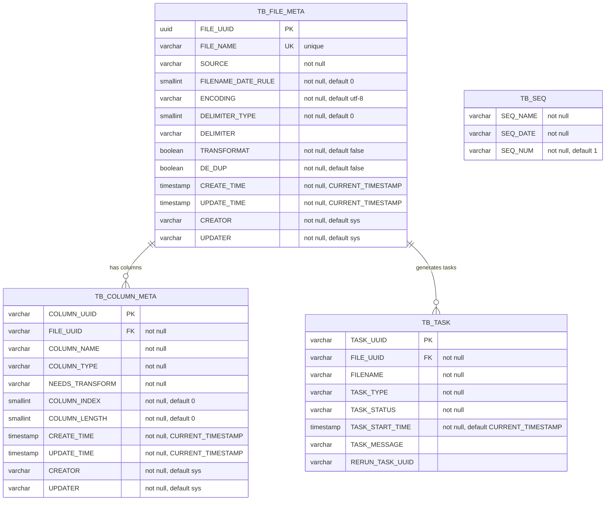

## 共享的資料結構

### 資料庫
--- 

```mermaid
erDiagram
    TB_FILE_META ||--o{ TB_COLUMN_META : "has columns"
    TB_FILE_META ||--o{ TB_TASK : "generates tasks"

    TB_FILE_META {
        uuid FILE_UUID PK
        varchar FILE_NAME UK "unique"
        varchar SOURCE "not null"
        smallint FILENAME_DATE_RULE "not null, default 0"
        varchar ENCODING "not null, default utf-8"
        smallint DELIMITER_TYPE "not null, default 0"
        varchar DELIMITER
        boolean TRANSFORMAT "not null, default false"
        boolean DE_DUP "not null, default false"
        timestamp CREATE_TIME "not null, CURRENT_TIMESTAMP"
        timestamp UPDATE_TIME "not null, CURRENT_TIMESTAMP"
        varchar CREATOR "not null, default sys"
        varchar UPDATER "not null, default sys"
    }

    TB_COLUMN_META {
        varchar COLUMN_UUID PK
        varchar FILE_UUID FK "not null"
        varchar COLUMN_NAME "not null"
        varchar COLUMN_TYPE "not null"
        varchar NEEDS_TRANSFORM "not null"
        smallint COLUMN_INDEX "not null, default 0"
        smallint COLUMN_LENGTH "not null, default 0"
        timestamp CREATE_TIME "not null, CURRENT_TIMESTAMP"
        timestamp UPDATE_TIME "not null, CURRENT_TIMESTAMP"
        varchar CREATOR "not null, default sys"
        varchar UPDATER "not null, default sys"
    }

    TB_TASK {
        varchar TASK_UUID PK
        varchar FILE_UUID FK "not null"
        varchar FILENAME "not null"
        varchar TASK_TYPE "not null"
        varchar TASK_STATUS "not null"
        timestamp TASK_START_TIME "not null, default CURRENT_TIMESTAMP"
        varchar TASK_MESSAGE
        varchar RERUN_TASK_UUID
    }

    TB_SEQ {
        varchar SEQ_NAME "not null"
        varchar SEQ_DATE "not null"
        varchar SEQ_NUM "not null, default 1"
    }
```
